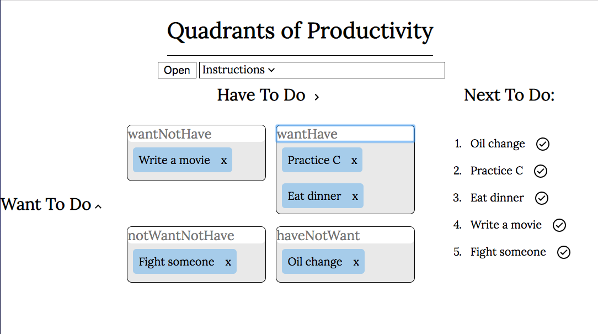

## Description

A task manager designed with psychology in mind.  
In theory, you don't need to be reminded to do what you want to do. Such tasks are given a low priority, lower still if you don't need to do them. Other tasks, such as getting your vehicle's oil changed, will be at the top of the list.

